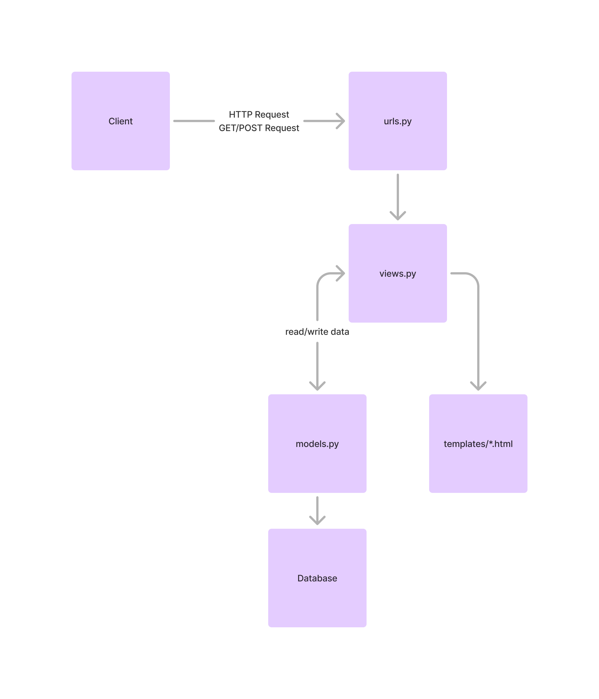

## [Jasucat House](http://wida-putri31-jasucathouse.pbp.cs.ui.ac.id/)

# Tugas 2

## Jelaskan bagaimana cara kamu mengimplementasikan checklist di atas secara step-by-step (bukan hanya sekadar mengikuti tutorial).
### Membuat sebuah proyek Django baru.
Langkah pertama adalah membuat virtual environment agar dependencies aplikasi tidak nabrak dengan yang sudah diinstall, lalu menginstall semua dependency yang akan diperlukan aplikasi. Lalu, inisiasi proyek Djangonya. Jangan lupa untuk configure allowed hosts agar dapat dijalankan. Jangan lupa juga dihubungkan ke GitHub

### Membuat aplikasi dengan nama main pada proyek tersebut.
Start app main dan tambah ke installed apps.

### Melakukan routing pada proyek agar dapat menjalankan aplikasi main.
Menambahkan urls main ke urls jasucat_house untuk menghubungkan dengan rute URL proyek

### Membuat model pada aplikasi main dengan nama Product dan memiliki atribut wajib.
Dibuat di models.py sesuai keperluan. Menambah atribut stock juga.

### Membuat sebuah fungsi pada views.py untuk dikembalikan ke dalam sebuah template HTML yang menampilkan nama aplikasi serta nama dan kelas kamu.
Buat context di views dan pastikan cocok dengan template variables sesuai. Render di views.py

### Membuat sebuah routing pada urls.py aplikasi main untuk memetakan fungsi yang telah dibuat pada views.py.
Membuat urls.py di main dan menampilkan show_main.

### Melakukan deployment ke PWS terhadap aplikasi yang sudah dibuat sehingga nantinya dapat diakses oleh teman-temanmu melalui Internet.
Jalankan project command yang muncul setelah memulai proyek baru di PWS dan push ke PWS tiap ada perubahan.


## Buatlah bagan yang berisi request client ke web aplikasi berbasis Django beserta responnya dan jelaskan pada bagan tersebut kaitan antara urls.py, views.py, models.py, dan berkas html.


## Jelaskan fungsi git dalam pengembangan perangkat lunak!
Melacak perubahan kode dan menyimpan versi-versi sebelumnya agar ketika menemukan masalah dapat dipulihkan kembali ke versi tanpa error. Juga mendukung kolaborasi tim agar kode semua developer dapat terintregrasi dengan baik.

## Menurut Anda, dari semua framework yang ada, mengapa framework Django dijadikan permulaan pembelajaran pengembangan perangkat lunak?
Django berbasis python yang jika dibandingkan dengan bahasa pemrograman lain terhitung cukup intuitif bagi pemula. Merupakan bahasa yang populer juga sehingga dokumentasi lengkap dan mudah untuk troubleshooting dari komunitas.

## Mengapa model pada Django disebut sebagai ORM?
ORM adalah teknik pemrograman yang digunakan untuk berinteraksi dengan basis data lewat pemetaan objek dalam suatu bahasa pemrograman ke tabel dalam basis data relasional. Misal:
```
class Product(models.Model):
    name = models.CharField(max_length=255)
    price = models.IntegerField()
    description = models.TextField()
    stock = models.IntegerField()
```
Di blok kode di atas, objek Product melambangkan satu tabel di basis data, sedangkan name, price, description, dan stock melambangkan kolom-kolom di tabel tersebut.


# Tugas 3
## Jelaskan mengapa kita memerlukan data delivery dalam pengimplementasian sebuah platform?
Data delivery penting dalam pengimplementasian platform karena memastikan komunikasi yang cepat dan aman antara komponen, sehingga data dapat diakses secara real-time, sinkron, dan efisien. Hal ini meningkatkan performa platform, menjaga keamanan informasi, dan memungkinkan platform untuk berskala besar dengan latensi yang rendah. Data delivery yang handal juga memastikan bahwa pengguna selalu bekerja dengan data yang up-to-date, mendukung pertumbuhan platform tanpa mengorbankan kualitas layanan.

## Menurutmu, mana yang lebih baik antara XML dan JSON? Mengapa JSON lebih populer dibandingkan XML?
JSON lebih populer dibandingkan XML karena lebih sederhana, ringan, dan mudah dibaca, baik oleh manusia maupun mesin. JSON memiliki sintaks yang lebih ringkas dan langsung dibandingkan XML, yang seringkali memerlukan tag pembuka dan penutup yang memperbesar ukuran data. Selain itu, JSON lebih mudah digunakan dalam pemrograman modern, terutama dalam JavaScript, karena objek JSON secara langsung dapat diparsing menjadi objek JavaScript. Kinerja parsing JSON juga umumnya lebih cepat dibandingkan XML, yang menjadikannya pilihan utama dalam pengiriman data melalui API dan layanan web di era aplikasi berbasis web yang dinamis. Menurut saya, keduanya memiliki kelebihan dan kekurangannya masing-masing, JSON lebih sederhana dan ringan, sementara XML lebih fleksibel dan sering digunakan untuk skenario yang memerlukan format data yang lebih kompleks.

## Jelaskan fungsi dari method is_valid() pada form Django dan mengapa kita membutuhkan method tersebut?
Method is_valid() pada form Django digunakan untuk memeriksa apakah data yang dimasukkan ke dalam form memenuhi semua validasi yang telah didefinisikan di dalam form tersebut. Method ini memproses input, memeriksa apakah data sesuai dengan tipe yang diharapkan, dan memastikan semua aturan validasi (seperti panjang maksimum, format, dan keharusan diisi) terpenuhi. Jika semua data valid, is_valid() akan mengembalikan nilai True, dan data yang divalidasi dapat diakses melalui cleaned_data. Method ini penting untuk memastikan bahwa data yang diterima dari pengguna bersih, aman, dan sesuai untuk diproses lebih lanjut oleh aplikasi sebelum disimpan atau digunakan.

## Mengapa kita membutuhkan csrf_token saat membuat form di Django? Apa yang dapat terjadi jika kita tidak menambahkan csrf_token pada form Django? Bagaimana hal tersebut dapat dimanfaatkan oleh penyerang?
csrf_token dalam form Django diperlukan untuk melindungi aplikasi dari serangan Cross-Site Request Forgery (CSRF), di mana penyerang dapat mencoba mengirim permintaan berbahaya atas nama pengguna yang sedang terautentikasi di aplikasi tersebut tanpa sepengetahuan mereka. Token ini memastikan bahwa setiap permintaan POST yang diterima server berasal dari sumber yang sah dengan memverifikasi token unik yang dikirim bersama form. Jika tidak ada csrf_token, penyerang dapat memanfaatkan kelemahan ini dengan membuat permintaan berbahaya dari situs lain, misalnya mengirim form tanpa izin pengguna, yang dapat mengakibatkan pencurian data, perubahan data, atau tindakan berbahaya lainnya di aplikasi. Dengan csrf_token, hanya permintaan yang berasal dari sumber yang valid yang akan diproses oleh server, sehingga meningkatkan keamanan aplikasi.

## Jelaskan bagaimana cara kamu mengimplementasikan checklist di atas secara step-by-step (bukan hanya sekadar mengikuti tutorial).
### Membuat input form untuk menambahkan objek model pada app sebelumnya.
Pengerjaan dimulai dengan mengubah primary key Products menjadi UUID agar lebih aman. Selanjutnya, membuat struktur form baru di forms.py dan mengimportnya ke views.py. lalu, di views.py, membuat fungsi create_product(request). Form harus dipastikan valid dan request methodnya POST. Lalu memodifikasi fungsi show_main agar dapat mendisplay data kita. Terakhir, membuat create_product.html untuk halaman penginputan data dan melakukan routing untuk halaman tersebut.

### Tambahkan 4 fungsi views baru untuk melihat objek yang sudah ditambahkan dalam format XML, JSON, XML by ID, dan JSON by ID.
Untuk menampilkan semua data, kita membuat fungsi yang mengambil semua data kita dan mereturn hasil serialisasinya menjadi JSON/XML. Untuk by ID, mirip tetapi kita perlu menambahkan parameter ID serta memfilter datanya by ID.

### Membuat routing URL untuk masing-masing views yang telah ditambahkan pada poin 2.
Mengimport ke urls.py di main dan menambahkan path yang sesuai.

## GET Postman


# Tugas 4
## Apa perbedaan antara HttpResponseRedirect() dan redirect()
Perbedaan HttpResponseRedirect() dan redirect() terletak di fleksibilitas dan penggunaannya. HttpResponseRedirect() merupakan response yang class-based, yang hanya menerima URL untuk redirection, sehingga pengguna harus menyediakan URL penuhnya secara manual. Sedangkan, redirect merupakan fungsi shortcut yang menerima tidak hanya URL, tapi juga nama view atau instance model, yang membuatnya lebih fleksibel dan mudah digunakan.

## Jelaskan cara kerja penghubungan model Product dengan User!
Penghubungan dilakukan dengan cara menambahkan user sebagai salah satu foreign key dari Product atau dengan kata lain menyimpan atribut user untuk tiap produk yang dibuat. Sebelum hasilnya tersimpan, tiap produk yang dibuat akan dihubungkan dengan user yang sedang logged in. Kita juga bisa menampilkan produk user tertentu dengan memfilter semua produk berdasarkan atribut user.

## Apa perbedaan antara authentication dan authorization, apakah yang dilakukan saat pengguna login? Jelaskan bagaimana Django mengimplementasikan kedua konsep tersebut.
Authentication dan authorization adalah dua konsep berbeda dalam keamanan projek Django kita. Authentication memastikan identitas user, memverifikasi siapa mereka, biasanya melalui proses login dengan username dan password. Authorization terjadi setelah authentication, menentukan apa yang diizinkan pengguna lakukan berdasarkan hak akses mereka. Dalam Django, authentication dilakukan saat pengguna login, menggunakan fungsi bawaan seperti authenticate() untuk memverifikasi kredensial dan login() untuk membuat sesi pengguna. Setelah login, Django menggunakan middleware dan decorators seperti @login_required untuk mengelola authorization, memastikan hanya pengguna yang memiliki izin yang dapat mengakses fitur atau halaman tertentu berdasarkan sistem izin yang terintegrasi dengan model user dan groups.

## Bagaimana Django mengingat pengguna yang telah login? Jelaskan kegunaan lain dari cookies dan apakah semua cookies aman digunakan?
Django mengingat pengguna yang telah login menggunakan session cookies. Saat pengguna login, Django membuat sesi yang mengasosiasikan user dengan server, dan informasi sesi disimpan di cookie yang dikirim ke browser. Browser kemudian mengirimkan cookie ini bersama setiap permintaan, memungkinkan Django mengenali pengguna tanpa memerlukan login ulang. Selain untuk sesi login, cookies juga digunakan untuk menyimpan preferensi pengguna, pengaturan situs, dan data lainnya yang membantu pengalaman pengguna. Namun, tidak semua cookies aman; cookies yang tidak terenkripsi atau memiliki konfigurasi yang salah bisa disalahgunakan untuk serangan seperti session hijacking. Oleh karena itu, Django menyediakan pengaturan seperti SECURE_COOKIE dan HttpOnly untuk memastikan cookies hanya dapat diakses melalui HTTPS dan tidak dapat diakses oleh JavaScript, meningkatkan keamanan cookies.

## Jelaskan bagaimana cara kamu mengimplementasikan checklist di atas secara step-by-step (bukan hanya sekadar mengikuti tutorial).
### Mengimplementasikan fungsi registrasi, login, dan logout untuk memungkinkan pengguna untuk mengakses aplikasi sebelumnya dengan lancar.
Django menyediakan UserCreationForm yang dapat kita gunakan secara mudah. Kita hanya perlu membuat fungsi register di views.py yang memvalidasi input, menyimpan hasil, dan meredirect ke main page ketika sukses membuat akun. Begitu pula untuk login, Django sudah menyediakan AuthenticationForm. Di views.py, kita hanya perlu membuat fungi login_user yang memanfaatkan fungsi bawaan login(). Untuk logout, kita juga hanya perlu mendefinisikan logout_user di views.py yang memanfaatkan fungsi logout(). Selanjutnya kita hanya perlu melengkapi html dan melakukan routing yang sesuai. 

### Membuat dua akun pengguna dengan masing-masing tiga dummy data menggunakan model yang telah dibuat pada aplikasi sebelumnya untuk setiap akun di lokal.
Ini dapat dilakukan langsung di user interface yang sudah kita buat. Register, login, tambah produk, lalu logout.

### Menghubungkan model Product dengan User.
Terjawab di atas.

### Menampilkan detail informasi pengguna yang sedang logged in seperti username dan menerapkan cookies seperti last login pada halaman utama aplikasi.
Pertama kita harus membuat cookie last_login menggunakan method set_cookie di sebuah Response dan menyimpan waktu di fungsi login kita. Lalu, karena kita ingin menampilkan di main page, kita dapat memodifikasi context show_main kita untuk menambahkan informasi cookie last_login. Untuk menampilkannya, kita hanya perlu menggunakan template tags di main.html dan untuk menampilkan username, kita hanya perlu memanggil atribut nama user yang sedang logged in (response.user.username).

# Tugas 5
## Jika terdapat beberapa CSS selector untuk suatu elemen HTML, jelaskan urutan prioritas pengambilan CSS selector tersebut!
Jika suatu elemen HTML dipengaruhi oleh beberapa CSS selector, urutan prioritas yang menentukan selector mana yang akan digunakan disebut Specificity. Berikut adalah urutan prioritas CSS selector dari yang paling rendah ke paling tinggi:
- Elemen (misalnya, div, p, h1) — Specificity: 0,0,0,1
- Kelas (class) (misalnya, .class-name) — Specificity: 0,0,1,0
- Pseudokelas (misalnya, :hover, :nth-child()) — Specificity: 0,0,1,0
- ID (misalnya, #id-name) — Specificity: 0,1,0,0
- Inline style (misalnya, style="color: red;") — Specificity: 1,0,0,0
- !important — Mengalahkan semua aturan lainnya, terlepas dari specificity selector.
CSS akan menggunakan selector dengan specificity tertinggi. Jika specificity dua selector sama, maka urutannya dilihat dari aturan yang didefinisikan terakhir di file CSS.

## Mengapa responsive design menjadi konsep yang penting dalam pengembangan aplikasi web? Berikan contoh aplikasi yang sudah dan belum menerapkan responsive design!
Responsive design adalah teknik desain web yang memungkinkan tampilan aplikasi atau website menyesuaikan diri dengan berbagai ukuran layar atau perangkat, seperti smartphone, tablet, dan desktop. Ini sangat penting karena:
- Pengguna mengakses web dari berbagai perangkat dengan ukuran layar yang berbeda-beda.
- Meningkatkan user experience (UX) di semua perangkat.
- Google memprioritaskan situs yang mobile-friendly dalam hasil pencarian (SEO).
Contoh aplikasi:
- Sudah menerapkan: Twitter, YouTube, dan Medium.
- Belum menerapkan: SIAK NG

## Jelaskan perbedaan antara margin, border, dan padding, serta cara untuk mengimplementasikan ketiga hal tersebut!
### Margin
Jarak antara elemen dengan elemen lain di luar elemen tersebut. Contoh di CSS:
```
.element {
  margin: 20px;
}
```
### Border
Garis yang mengelilingi konten elemen, berada di antara margin dan padding. Contoh di CSS:
```
.element {
  border: 2px solid black;
}
```
### Padding
Jarak antara konten di dalam elemen dengan batas (border) elemen tersebut. Contoh di CSS:
```
.element {
  padding: 10px;
}
```

## Jelaskan konsep flex box dan grid layout beserta kegunaannya!
### Flexbox (Flexible Box Layout)
Layout ini dirancang untuk mendistribusikan ruang dalam sebuah kontainer dan menyusun item secara fleksibel. Flexbox berguna untuk one-dimensional layout, di mana elemen bisa disusun secara horizontal (row) atau vertical (column). Flexbox sangat berguna ketika menyusun elemen-elemen seperti navigasi atau card secara sejajar.
### Grid Layout
Grid layout adalah teknik yang lebih canggih daripada Flexbox untuk two-dimensional layout (baris dan kolom). Grid memungkinkan untuk membuat struktur layout yang lebih kompleks dengan kontrol penuh terhadap kolom dan baris. Grid sangat bermanfaat dalam membangun layout halaman yang memiliki struktur grid seperti dashboard atau gallery.

Keduanya menawarkan cara yang berbeda untuk mendesain layout yang fleksibel, dengan Flexbox untuk layout satu dimensi dan Grid untuk layout dua dimensi.

